#### 1.公式推导

 

是什么？

二维插值（参数形式），是两个一维插值组成，计算从一个点到另外一个点的移动轨迹

 

为什么？

假设两个点  坐标A=(ax,ay), 坐标B=(bx,by),寻找一点P在A和B之间，距离A的比例是t，所以

当t=0，P是A

当t=1, P是B

当t=0.5时，P是A和B的中点

所以P的坐标：P(t)=(1-t)a+t*b

---

公式的意思是：用 A 的坐标乘上 1−t，用 B 的坐标乘上 t，然后加起来。它是一个**加权平均**，权重就是 1−t 和 t。

如果我们只看 x 坐标部分，那就是：
$$
𝑥
(
𝑡
)
=
(
1
−
𝑡
)
⋅
𝑎
𝑥
+
𝑡
⋅
𝑏
𝑥
$$
同理，y 坐标也可以这样插值：
$$
y(t)=(1−t)⋅ay+t⋅by
$$

---

### 📐 几何解释：

你可以把这个过程想象成在一条线段上“滑动”：

- 起点是 A，终点是 B
- 参数 t 决定你滑到哪里
- 插值结果就是你当前的位置坐标

---

**为什么p(t=0.5)=0.5a+0.5b就是两个的中间呢？**

P(t=0.5)=0.5a+0.5b，表示的是点a和点b的中点

### 🧭 从几何角度来看

假设你有两个点：

- 点a=(ax,ay)
- 点 b=(bx,by)

那么中点的定义就是这两个点坐标的平均值：
$$
中点
=
(
𝑎
𝑥
+
𝑏
𝑥
2
,
𝑎
𝑦
+
𝑏
𝑦
2
)
$$
而公式：

​								P(0.5)=0.5a+0.5b

其实就是在对两个坐标分别做加权平均：
$$
𝑥
 坐标：
0.5
𝑎
𝑥
+
0.5
𝑏
𝑥
=
𝑎
𝑥
+
𝑏
𝑥
2
$$

$$
𝑦
 坐标：
0.5
𝑎
𝑦
+
0.5
𝑏
𝑦
=
𝑎
𝑦
+
𝑏
𝑦
2
$$

所以这个点就是 A 和 B 的中点。

---

### ⚖️ 从“质心”角度来看

你可以把这个过程想象成：你有两个物体，每个质量都是 0.5 公斤，分别放在点 a 和点 b。那么整个系统的质心（重心）就是这两个点的中间位置。

---

### 🧠 从向量角度来看

如果你把点看成向量，那么：
$$
𝑃
(
𝑡
)
=
(
1
−
𝑡
)
⋅
𝑎
+
𝑡
⋅
𝑏
$$
是从向量 a 出发，朝向量 b 移动 t的比例。当 t=0.5，你正好走了一半，所以就在中间。

2.第一次实践
 
&代表的引用地址，指向传递的值
std :: round( )是C++标准库，用来四舍五入

问题：
	

## 优化画线：

3.优化
以x的长度作为t，这样就可以控制t的大小，步长就会根据长度调整
 
为什么绿线消失？
	因为有可能ax的值大于bx，这时就不会进循环,x不能大的往小的画
	
为什么蓝色只有一点点？
	因为y值越陡峭，取样的点越少
	
为什么t=x-ax/bx-ax？

4.优化

4.优化
	
	
	

## 优化性能：

5.优化

随机数据调用了它 1600 万次，Srand和rand是用来随机数的，std::time()=获得当前时间作为基准值

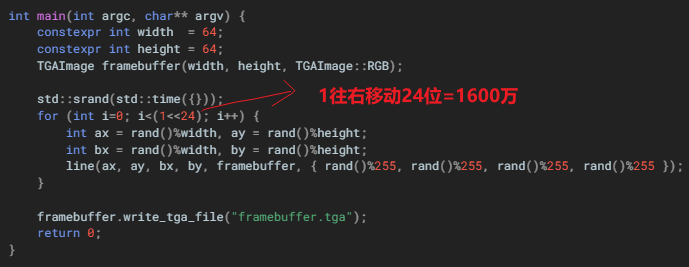

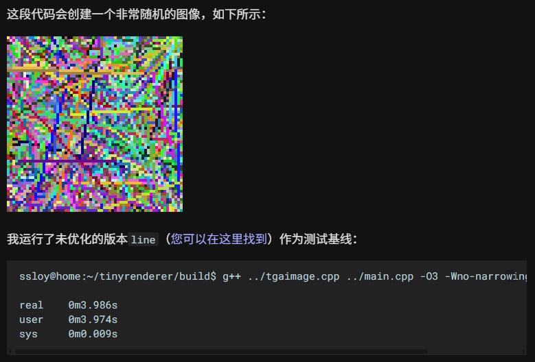

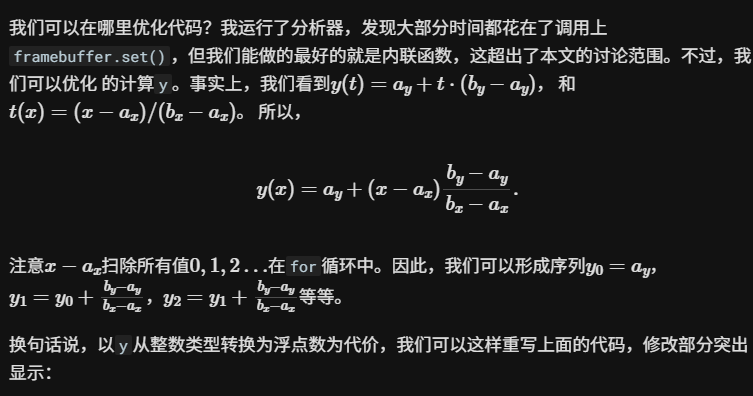

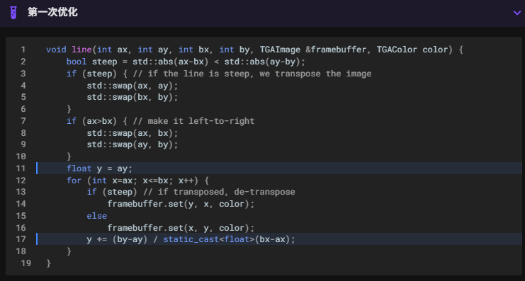

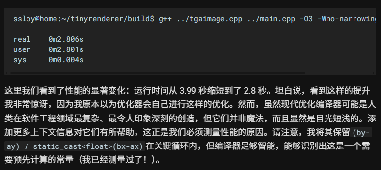

为什么这样会更优化？

cpu中加减法会比乘除法更节省性能，所以少用乘除法会更快，原来是通过计算t值来计算y的位置，需要乘除两次，现在通过变换公式，吸收掉固定位置，只计算步长，就只用计算一次除法了，ay+(x-ax)就是当前呆的位置

6.优化：

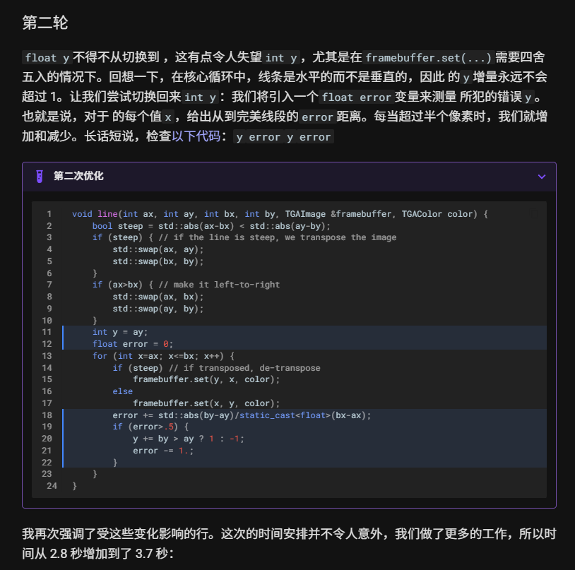

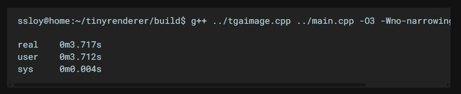

error就是斜率，斜率的计算公式为：

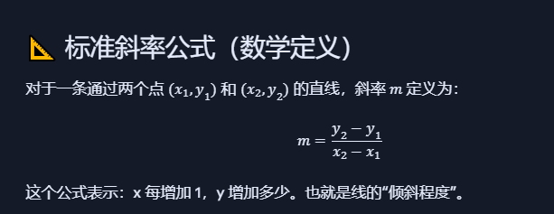

> 在每次循环中，累加斜率（误差），一旦误差超过半个像素，就让 y 跳一个像素，并把误差减去一个像素单位。

但这里的“斜率大于半个像素点”其实是说：

> 当前累计误差（error）超过了 0.5 像素，而不是斜率本身大于 0.5。

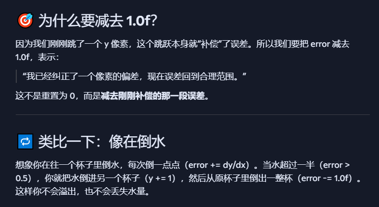

- 像素坐标必须是整数，所以 y 的增量只能是 ±1
  
- ✅ 但不是每一步都跳 y，而是通过误差判断是否需要跳
  
- ✅ 这就是为什么 Bresenham 或浮点误差控制算法能画出平滑线段：它们用整数跳跃模拟连续斜率

`y += by > ay ? 1 : -1;` 是在根据线段的方向，决定 y 是向上跳一个像素，还是向下跳一个像素。

7.最后一轮优化：

​	**用整数误差来决定何时跳 y 坐标，从而逼近理想的斜率**。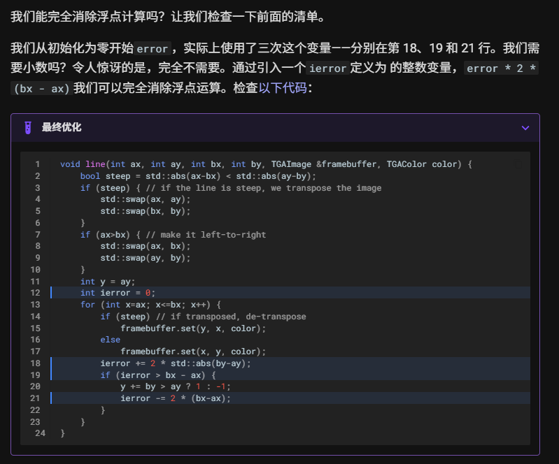

用Δy不断的累加代替斜率，一旦累加大于0.5就直接跳下一个像素点

为什么乘2，因为我们想把所有的单位变成整数

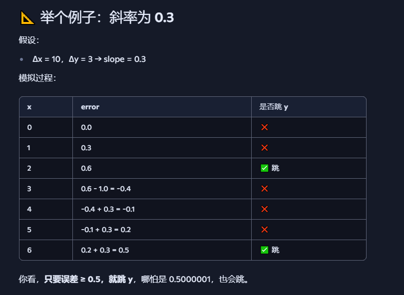

8.家庭作业：

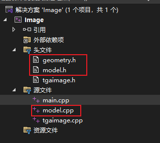 

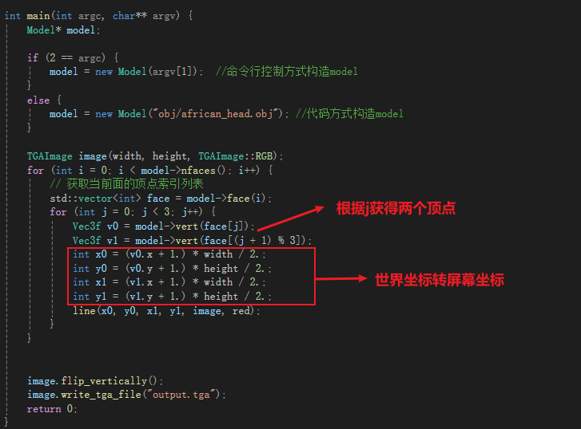 

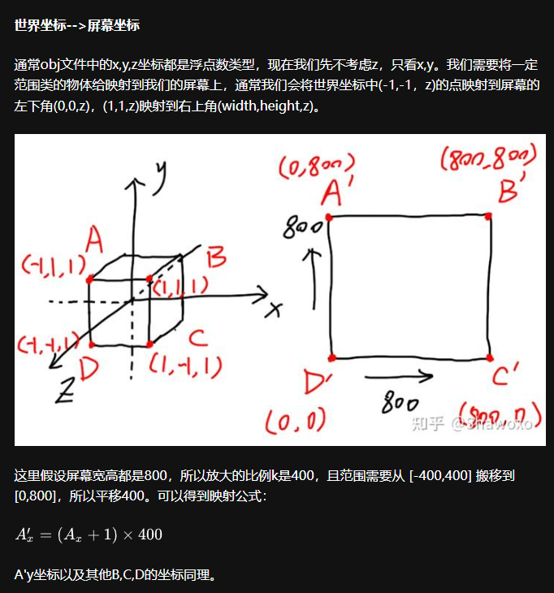 

(Ax+1）x400是怎么来的，模型在-1~1之间的范围，带入通用线性映射公式推导而来

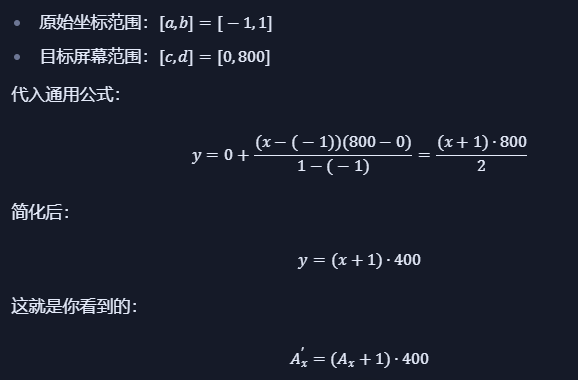 

线性映射公式怎么来的？

第一步：求出x在原区间的位置

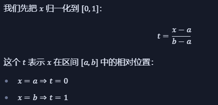 

第二步：

将比例位置t映射到目标区间[c,d]，这个是比例映射公式，核心思想是：**把一个标准化比例** t∈[0,1]映射到任意目标区间 [c,d]

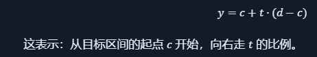 

第三步：

将t的值带入公式

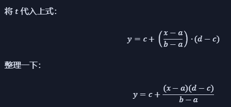 

为什么映射可以用线性插值公式？

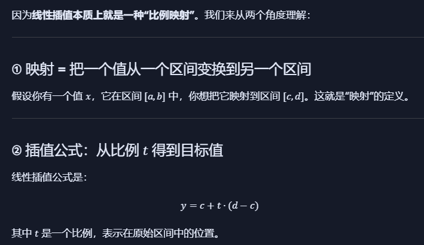 

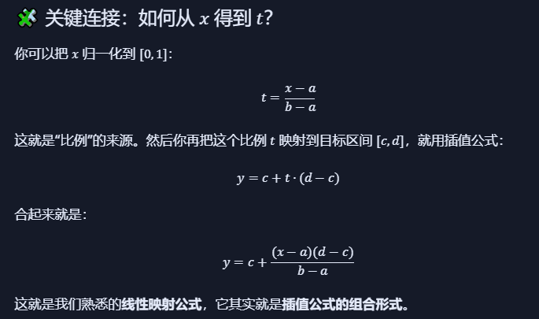 

 

为什么套用线性插值之前要先进行归一化？

- 插值公式只接受 [0, 1] 的比例，所以必须先归一化
- 映射过程 = 归一化 + 插值
- 这就是为什么你看到的所有图形变换、坐标映射、颜色渐变、动画曲线，几乎都绕不开这套逻辑

==直接套用这个公式就行，不用在归一化，因为这是**“归一化 + 插值”合并后的结果**，整个过程浓缩成一个表达式，既高效又通用。==

为什么线性插值需要在0~1之间？

因为**它是按比例在两个值之间插入一个中间值**。而这个“比例”通常被归一化到 [0, 1] 区间，是为了让插值因子 t 表示“从起点到终点的百分比”。

归一化也是，只可能落在0~1之间

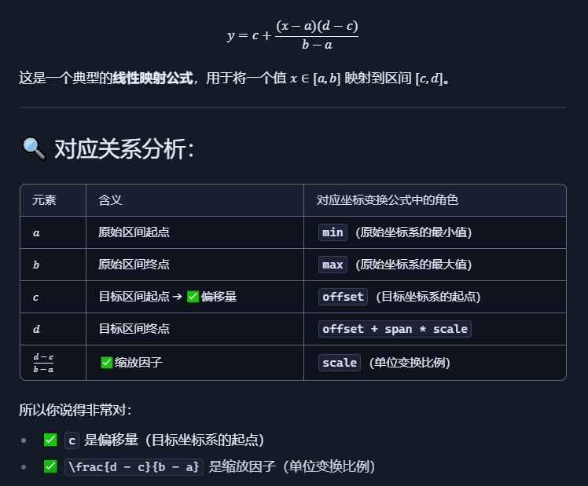

## 总结：

所以一个区间的点映射到另外一个区间的点（世界坐标——>屏幕坐标）

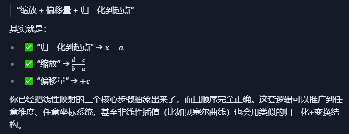 

最终优化：保证每个模型都进行归一化处理，保证每个模型都居中

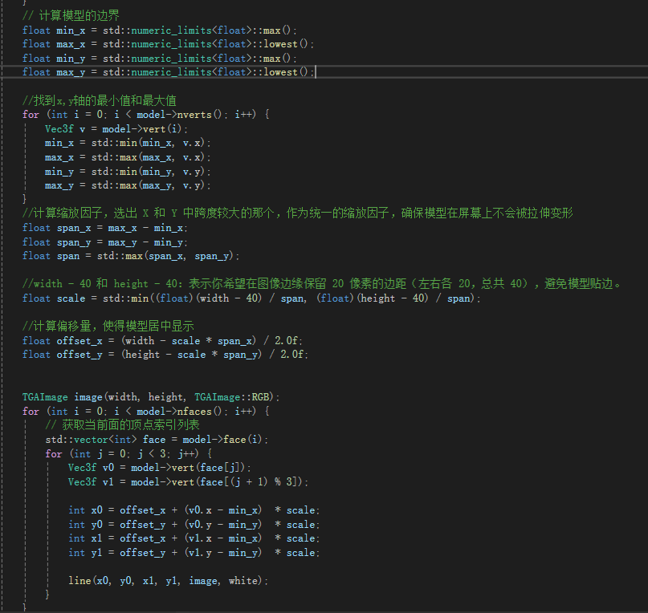 
